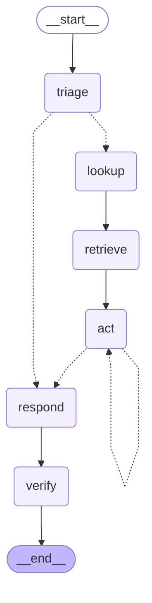
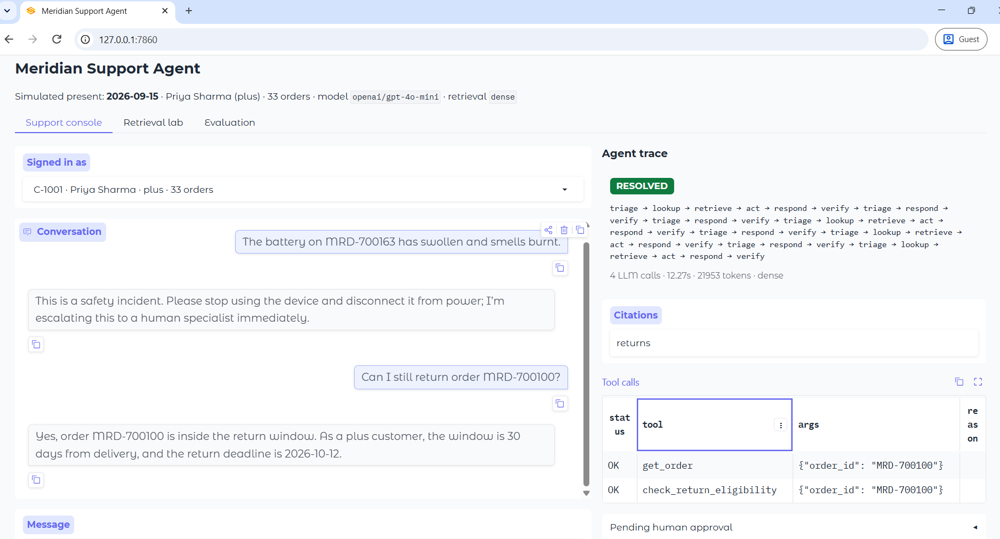

# HW2 Report — Lakshmi Suryanarayanan

## The short version

| | Score on 24 practice questions |
|---|---:|
| Shipped baseline | 70.31 |
| Highest recorded run (hybrid, cache disabled) | **94.58** |
| Dense comparison run | 92.92 |

The latest no-cache hybrid development evaluation scored **94.58 / 100**. It reported route **1.000**, actions **0.979**, facts **1.000**, citations **0.688**, and **0 safety violations**. This is not a score on the hidden 72-query test set. The weakest query was `dev-008` (0.78), which missed `create_return`. The dense run scored 92.92 on the same practice set, so the latest hybrid run was 1.66 points higher; model output can vary between runs, so this is an observed comparison, not proof that hybrid caused the gain.

I used `openai/gpt-4o-mini` as the tool-capable model and `meta-llama/llama-3.1-8b-instruct` as the fast model. The default retrieval mode is dense; chunks are 600 characters with 150 characters of overlap. The latest hybrid run disabled the LLM cache and made 95 GPT-4o-mini calls (80,651 input and 1,927 output tokens) and 17 Llama calls (7,501 input and 201 output tokens). Cost was estimated per model as `(input_tokens × input_rate + output_tokens × output_rate) ÷ 1,000,000`, using listed rates in USD per million tokens: GPT-4o-mini `(80,651 × $0.15 + 1,927 × $0.60) ÷ 1,000,000 = $0.013254`; Llama `(7,501 × $0.02 + 201 × $0.04) ÷ 1,000,000 = $0.000158`. The combined estimate is **$0.013412**. The estimate covers this 24-query run only, not the cumulative cost of all experiments. OpenRouter rates can change, so this estimate uses the rates recorded in `support_agent/config.py` at run time ([GPT-4o-mini pricing](https://openrouter.ai/openai/gpt-4o-mini), [Llama pricing](https://openrouter.ai/meta-llama/llama-3.1-8b-instruct)). The traces are in `dev_traces_hybrid_nocache.jsonl`.

## What I changed, and what each change was worth

The available checkpoints are not a controlled score for every TODO in isolation. I report combined checkpoints where that is all that was recorded.

| Change | Practice result after change | Kept? |
|---|---:|---|
| Starting baseline | 70.31 / 100 | Baseline |
| TODO 4 tool loop | 71.67 / 100 | Yes |
| TODO 2 retrieval configuration | 69.90 / 100; separate retrieval-only recall: dense 65.5%, hybrid 69.0% | Yes; dense remains default, hybrid measured separately |
| TODO 1 structured chunking | 14 handbook sections; changed from 36 fixed chunks to 46 structured chunks at size 600 / overlap 150; no separate retrieval score | Yes; used in the recorded runs |
| TODO 3 + TODO 4 + initial TODO 6 | 52.40 / 100; combined checkpoint, not an isolated verifier score | Yes |
| TODO 6 complete flow | 77.29 / 100 | Yes |
| TODO 5 injection defense | 77.08 / 100 full run; not an isolated effect | Yes |
| Final dense run | 92.92 / 100 | Yes |
| Final hybrid run with cache disabled | **94.58 / 100** | Yes; comparison only, one run per mode |

The largest recorded gain is the integrated result, from 70.31 at baseline to 94.58 in the latest run; the checkpoints do not isolate which single change caused it. The retrieval-only hybrid test gained 3.5 percentage points of recall over dense, but that did not guarantee a higher end-to-end score in every run. A query-translation experiment that removed order IDs and constrained the rewrite prompt scored 62.81, below the 69.90 restored-configuration checkpoint, so that version was discarded.

### Recorded development checkpoints

Older scores are retained as checkpoints because the implementation changed between runs and model output varies. The component order in the table is route / actions / facts / citations.

| Checkpoint | System score | Components / notes |
| --- | ---: | --- |
| Shipped baseline | 70.31 | Initial recorded result |
| First tool-loop run | 71.67 | TODO 4 |
| Early graph wiring | 31.98 | .333 / .604 / .000 / .167; zero safety violations |
| TODO 3 + TODO 4 + initial TODO 6 | 52.40 | .333 / .604 / .458 / .764 |
| After query translation | 58.96 | .500 / .604 / .542 / .785 |
| Restored retrieval configuration | 69.90 | .500 / .917 / .542 / .785 |
| Earlier TODO 5 full evaluation | 77.08 | Overall result, not isolated TODO 5 effect |
| TODO 6 complete-flow checkpoint | 77.29 | .792 / .917 / .771 / .410; zero safety violations |
| Route-fix checkpoint | 77.40 | .750 / .875 / .583 / .896 |
| Narrowed tuning | 80.00 | .875 / .854 / .625 / .840 |
| TODO 6 partial-wiring checkpoint | 80.73 | .875 / .875 / .625 / .840; zero safety violations |
| Dense development run | 92.92 | 1.000 / .979 / 1.000 / .576; zero safety violations; cached responses used |
| Hybrid development run, cache disabled | **94.58** | **1.000 / .979 / 1.000 / .688; zero safety violations; 0 cached calls** |
| Separate report-preparation rerun | 89.38 | `dev-006` hit an OpenRouter SSL certificate error and had no order lookup; not a clean comparison |

The dense run category scores were: `injection` 85.00; `refund_within_limit` 85.00; `safety_incident` 85.00; `return_eligibility` 88.75; `cancellation` 90.00; `escalate_other` 92.50; `refund_needs_approval` 93.75; `policy_qa` 95.00; `missing_info`, `multi_turn`, `order_status`, and `stale_policy` 100.00 each. In the latest no-cache hybrid run, cancellation scored 93.75 and refund within limit 100.00; injection and safety scored 85.00 each; all other categories scored 88.75 or higher, with missing info, multi-turn, order status, and stale policy at 100.00.

### Route confusion matrix

The route confusion matrix below compares the expected routes in `data/dev_gold.jsonl` with the actual routes in the 24-record `dev_traces.jsonl` file for the dense 92.92 development run. Rows are expected routes; columns are actual routes. All 24 routes matched (14 resolved, 2 needs-info, and 8 escalated), consistent with the route score of 1.000.

| Expected \\ Actual | Resolved | Needs info | Escalated | Total |
| --- | ---: | ---: | ---: | ---: |
| Resolved | 14 | 0 | 0 | 14 |
| Needs info | 0 | 2 | 0 | 2 |
| Escalated | 0 | 0 | 8 | 8 |
| **Total** | **14** | **2** | **8** | **24** |

Earlier category breakdowns are retained here. The 31.98 run scored refund within limit 17.50; escalation, injection, refund approval, and safety 25.00 each; return eligibility 26.25; cancellation, multi-turn, policy QA, and stale policy 35.00 each; missing info and order status 50.00 each. The 80.73 run scored refund approval 33.75; refund within limit 51.25; return eligibility 63.75; missing info and policy QA 75.00 each; multi-turn and safety 87.50 each; cancellation and injection 97.50 each; escalation, order status, and stale policy 100.00 each. The 77.29 run scored multi-turn 47.50; return eligibility 51.25; safety 56.25; policy QA 60.00; missing info 75.00; cancellation, refund within limit, and stale policy 85.00; escalation 91.25; refund approval 93.75; injection 97.50; order status 100.00.

## 1. Searching the handbook

`support_agent.kb.split_structured()` keeps chunks within handbook sections, preferring subsection headings, paragraph breaks, and sentence boundaries. The handbook has 14 sections. TODO 1 changed the initial 36 fixed chunks to 46 structured chunks at size 600 and overlap 150; section titles are included in chunk text. That chunk count is the direct TODO 1 result. The later dense and hybrid recall measurements evaluate retrieval, not chunking alone.

The retriever supports dense search and hybrid search. Hybrid combines dense embeddings with BM25 keyword results using Reciprocal Rank Fusion (RRF, `RRF_K=60`). With `TOP_K=4` and `CANDIDATE_K=8`, retrieval-only recall@4 was:

| Mode | Recall@4 | Observation |
| --- | ---: | --- |
| Dense | 19/29 = 65.5% | Baseline |
| Hybrid | 20/29 = 69.0% | One more relevant case, +3.5 percentage points |

Hybrid improved cancellation from 2/4 to 3/4 and escalation from 1/2 to 2/2, but stale-policy retrieval fell from 2/2 to 1/2. The gain was modest and not universal. Dense remains the default. Query translation improved a delayed-delivery example by retrieving the shipping section and coincided with a practice-score increase from 52.40 to 58.96; this was not an isolated controlled measurement of translation alone.

A later full-agent comparison used hybrid retrieval with the LLM cache disabled for all 24 practice queries. It scored 94.58 versus 92.92 for the recorded dense run; citations rose from 0.576 to 0.688, while route, actions, and facts were 1.000, 0.979, and 1.000 in the hybrid run. The hybrid run's estimated API cost was $0.013412. This is one run per mode, so output variation prevents attributing the score difference to retrieval mode alone.

The `community` section is untrusted and `archive_returns_2024` is superseded. Retrieval post-processing removes both from trusted results and citations. I exclude them completely because neither is authoritative, and keeping them in the response context risks the model treating gossip or the old rule as current policy. The metadata also prevents either from being cited as a valid source.

The measured retrieval-only comparison available in the run notes is dense versus hybrid: 65.5% versus 69.0% recall@4. Those measurements were made after retrieval implementation and belong to TODO 2, not TODO 1. I did not preserve a separate retrieval-only recall number that isolates structured chunking.

## 2. Checking the answer is true

`node_verify()` splits an answer into atomic claims and asks the model whether each is supported by retrieved handbook chunks, order facts, and the return-eligibility tool result. Faithfulness is the supported-claim count divided by total claims. The acceptance threshold is 100% supported claims. Unsupported or out-of-scope answers are replaced with an escalation response, subject to explicit routes and successfully executed actions; no separate score for uncovered handbook questions was recorded.

This check improves grounding but adds model calls, latency, and token use. No isolated before/after verifier measurement was recorded. In the latest 24-query hybrid run, all calls together used 90,280 tokens across both models, estimated at $0.013412; this is total run cost, not the verifier's incremental cost. Per-query trace latency averaged 7.76 seconds (median 7.44 seconds, p95 15.22 seconds); evaluation used four workers, so this is not total wall-clock duration. I would leave verification enabled because the run had a facts score of 1.000 and zero safety violations, while acknowledging that its separate contribution was not measured.

## 3. Tools and safety

`node_act()` runs a bounded tool-calling loop (`MAX_TOOL_STEPS=6`). It supplies policy and order facts, executes requested tools, returns their results to the model, and repeats. Unknown tools and tool failures are returned as errors rather than crashing the run. Deterministic checks handle safety incidents, repeat-ticket history, refund approval limits, return eligibility, and delayed-delivery credits.

In `dev-011`, the trace looked up order `MRD-700157` with `get_order`, then issued the permitted ₹500 wallet credit with `issue_wallet_credit` for a missed delivery date. Return flows similarly check eligibility after order lookup; `dev-008` still misses `create_return`, so that action path needs improvement.

Safety incidents are escalated at P1 with stop-use and disconnect-from-power guidance. Refund limits and approval requirements are enforced in policy/tool guards, not only in model instructions. The latest practice result had zero safety violations.

Prompt-injection defenses use common-pattern detection (`policy.detect_injection`), untrusted-content wrappers (`wrap_untrusted`), and code-level action guards. Detection covers common instruction overrides, authority bypasses, and forced responses. Injection scored 35.00 in the recorded baseline and 85.00 in the latest run, but many changes occurred between runs, so this is not an isolated causal comparison. A reworded attack that avoids the known phrases could evade pattern detection; code-level refund approval limits still restrict what action can actually execute.

## 4. Controlling the flow

The LangGraph has conditional routing after triage and action, a bounded action loop, response generation, and verification. When the action stage finishes, it routes to `respond`; the answer then passes through `verify`. The action router can also loop back to `act` when more tool calls are needed. `SupportState` accumulates messages and steps. `SupportAgent` uses `MemorySaver` by default, and conversation thread IDs support follow-up turns. The final `multi_turn` category score was 100.00.

### Human checkpoint functional example (separate from evaluator)

The route branches after triage to lookup or respond, then loops through `act` while tools are needed before responding and verifying. `multi_turn` scored 47.50 in an earlier 77.29 checkpoint and 100.00 in the latest run; other changes also occurred between those runs, so this is not a memory-only effect. The human checkpoint is configurable with `interrupt_before=["act"]`; the standard evaluator does not enable it. In `scripts/test_todo6.py`, an `MRD-700112` return first paused before `act`; after approval, the sequence was `get_order` → `check_return_eligibility` → `create_return`, and the return was raised. A rejection-path check escalated without carrying out the action.

The latest no-cache hybrid run had a 1.000 route score. Its route confusion counts map to the template’s human/solo table:

| | Agent fetched a human | Agent handled it alone |
|---|---:|---:|
| Should have fetched a human | 8 correct | 0 missed |
| Should have handled it alone | 0 unnecessary escalations | 16 correct |

The earlier rejection-path check used `approved=False` and returned an escalated result without proceeding. These are functional checkpoint checks, not additional development-evaluator measurements; no separate numeric score was recorded for them.



## Evidence

The latest no-cache hybrid result wrote 24 traces to `dev_traces_hybrid_nocache.jsonl`; it had no SSL failures or cached calls. Its lowest-scoring query was `dev-008` (0.78), which missed `create_return`. The 92.92 dense run and earlier 90.94 hybrid run are retained as separate comparison checkpoints; an SSL-failed hybrid attempt was excluded from score comparisons.



The latest hybrid category scores were: `injection` and `safety_incident` 85.00; `return_eligibility` 88.75; `escalate_other` 92.50; `cancellation` 93.75; `policy_qa` and `refund_needs_approval` 95.00; `refund_within_limit`, `missing_info`, `multi_turn`, `order_status`, and `stale_policy` 100.00. The lowest categories were injection and safety at 85.00; with another week, I would add targeted adversarial and safety regression cases, then measure them on a held-out set.

## How to run this

The full test suite passed **37 tests** during development. Commands used:

```powershell
python -m venv .venv
.\.venv\Scripts\Activate.ps1
python -m pip install -r requirements.txt
if (-not (Test-Path .env)) { Copy-Item .env.example .env }  # add key; never submit .env
.\.venv\Scripts\python.exe -X utf8 scripts\build_index.py --force
.\.venv\Scripts\python.exe -X utf8 scripts\evaluate_dev.py --workers 4 --show 10
$env:RETRIEVAL_MODE = "hybrid"
$env:LLM_CACHE = "false"
.\.venv\Scripts\python.exe -X utf8 scripts\evaluate_dev.py --workers 4 --show 8 --out dev_traces_hybrid_nocache.jsonl
.\.venv\Scripts\python.exe -X utf8 -m pytest tests -q
.\.venv\Scripts\python.exe -X utf8 -m support_agent.app
.\.venv\Scripts\python.exe -X utf8 scripts\run_batch.py --in data\test_queries.jsonl --out submission.jsonl
```

For the hybrid evaluation, set `$env:RETRIEVAL_MODE = "hybrid"` and `$env:LLM_CACHE = "false"` before the evaluation command. Set valid `SSL_CERT_FILE` and `REQUESTS_CA_BUNDLE` paths if the network requires a custom CA certificate. The run used OpenRouter models configured in `support_agent/config.py` and estimated cost from the listed per-model rates; check current rates before reproducing the estimate. The report screenshot is `screenshot.png`, which shows the web app trace panel.

OpenAI Codex assisted with code inspection, discussing evaluation failures, targeted edits, and report editing. Disclose any additional AI assistance and follow the course's individual-work rules.
